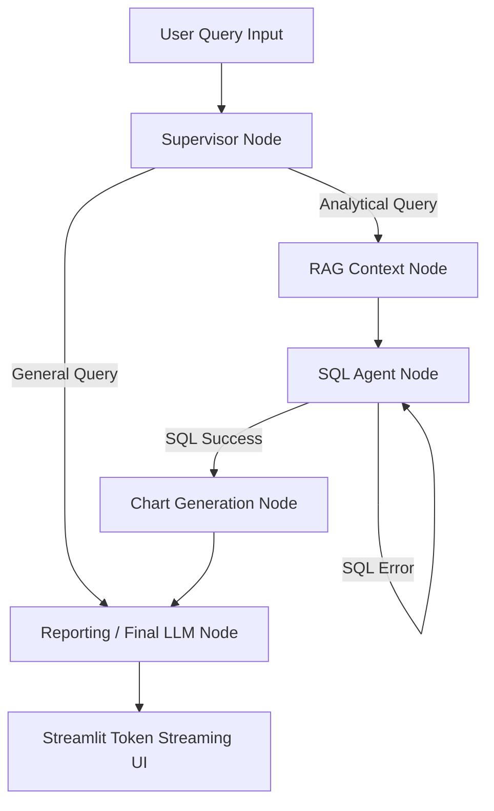

# 🤖 Autonomous Data Analytics & Document AI ChatBot

An intelligent, multi-agent AI system for interactive data analytics, automated SQL generation, document RAG (Retrieval-Augmented Generation), and real-time visualization generation built with **LangGraph**, **DuckDB**, **FAISS**, and **Streamlit**.

---

## 🌟 Key Features

- 📊 **Natural Language to SQL (DuckDB Engine)**: Convert natural language questions into optimized SQL queries and execute them against uploaded datasets automatically.
- 🔄 **Self-Healing SQL Execution**: Automatically catches database syntax errors or missing table/column errors, feeds the stack trace back to the LLM agent, and self-corrects up to maximum retry limits.
- 📚 **Document RAG System**: Upload PDFs/Text documents and ask contextual questions. Powered by vector embeddings and semantic search.
- 📈 **Automated Data Visualization**: Automatically detects analytical intent and generates publication-grade charts (Matplotlib / Seaborn) alongside query results.
- ⚡ **Real-Time Token Streaming**: Stream responses word-by-word with `st.write_stream` for a fast and responsive user experience.
- 🧠 **Multi-Turn Chat & Thread Memory**: Maintains per-user thread history (`user_id` + `thread_id`), restoring previous conversations, uploaded datasets, and active documents across sessions.
- 🔀 **Smart Supervisor Router**: Intelligently classifies user queries (`GENERAL`, `ANALYTICAL`, `DOCUMENT`, `HYBRID`) and routes them through specialized processing nodes.

---

## 🏗️ Architecture & Workflow

The system uses **LangGraph** to manage state and control flow across multiple specialized agent nodes:



### Node Workflow Breakdown:
1. **Supervisor Node**: Classifies user query type based on context and question intent.
2. **RAG Node**: Retrieves relevant table schemas, column descriptions, or document chunks from vector storage.
3. **SQL Agent Node**: Generates DuckDB SQL queries, executes them safely, and triggers self-healing retry loops if an error occurs.
4. **Chart Node**: Inspects query results and user intent to write and execute Matplotlib/Seaborn visualization code.
5. **Reporting Node**: Synthesizes tabular data, chart artifacts, and conversational history into a cohesive response.

---

## 📁 Repository Structure

```
.
├── app/                  # Application initialization & config
├── agents/               # LangGraph Agent implementations & node logic
├── core/                 # Core Graph state, LLM clients, and workflow builder
│   ├── build_graph.py    # LangGraph execution pipeline setup
│   ├── graph_state.py    # TypedDict state structure
│   └── llm_client.py     # LLM provider wrapper & streaming helper
├── database/             # Storage management
│   ├── duckdb_manager.py # DuckDB client & query executor
│   └── vector_db.py      # FAISS vector store & document indexing
├── prompts/              # System prompts & template definitions
│   ├── chart_prompts.py
│   ├── reporting_prompts.py
│   ├── sql_prompts.py
│   └── supervisor_prompts.py
├── schemas/              # Pydantic data models & state schemas
├── storage/              # Runtime user storage (ignored in Git)
│   ├── threads/          # Per-user thread histories & charts
│   └── uploads/          # Uploaded CSVs, Excel, and PDFs
├── main.py               # CLI entrypoint
├── streamlit_app.py      # Streamlit Web UI
├── requirements.txt      # Python dependencies
└── README.md             # Project documentation
```

---

## 🚀 Getting Started

### 1. Prerequisites
- **Python**: 3.10 or higher
- **NVIDIA GPU** *(Optional for local LLMs, CPU works fine with cloud API keys)*

### 2. Installation

Clone the repository and install dependencies:

```bash
git clone https://github.com/Jaypal-Singh/data_analytics_chatBot.git
cd data_analytics_chatBot

# Create and activate virtual environment
python3 -m venv .venv
source .venv/bin/activate

# Install required packages
pip install -r requirements.txt
```

### 3. Environment Configuration

Create a `.env` file in the root directory and add your API credentials:

```env
OPENAI_API_KEY=your_openai_api_key_here
# Or GROQ_API_KEY / ANTHROPIC_API_KEY depending on your LLM client configuration
LANGCHAIN_TRACING_V2=true
LANGCHAIN_API_KEY=your_langsmith_api_key_here  # Optional for LangSmith tracking
```

---

## 🖥️ Running the Application

Launch the Streamlit Web Application:

```bash
streamlit run streamlit_app.py --server.port 8501
```

Access the application in your browser at `http://localhost:8501`.

---

## 💡 How to Use

1. **User Identity & Threads**: Enter or select a `User ID` and `Thread ID` in the sidebar to load or isolate conversation state.
2. **Upload Data**: Use the sidebar uploader to add `.csv`, `.xlsx`, or `.pdf` files.
3. **Ask Analytical Questions**:
   - *"What are top 5 highest sales regions?"* -> Triggers DuckDB SQL + Chart node.
   - *"Summarize the uploaded document"* -> Triggers Document RAG node.
   - *"Hi, who are you?"* -> Triggers General conversation node.

---

## 🛡️ License & Contributing

Distributed under the MIT License. Contributions and feature suggestions are welcome via GitHub Pull Requests!
